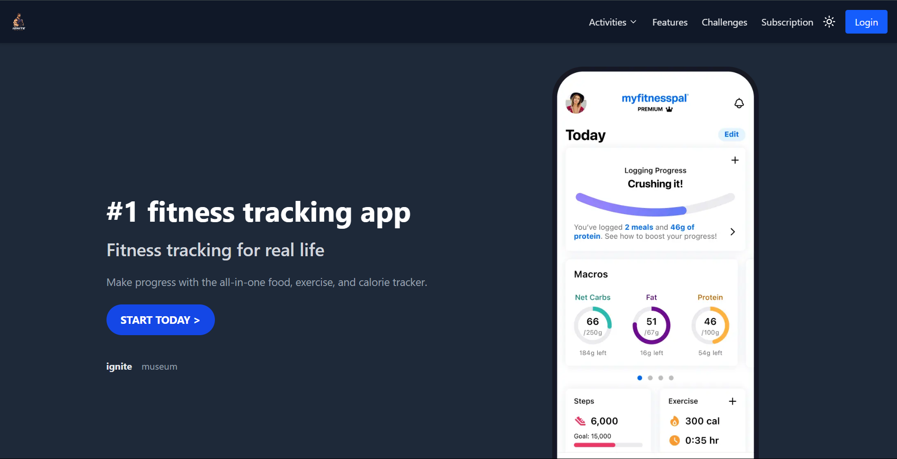
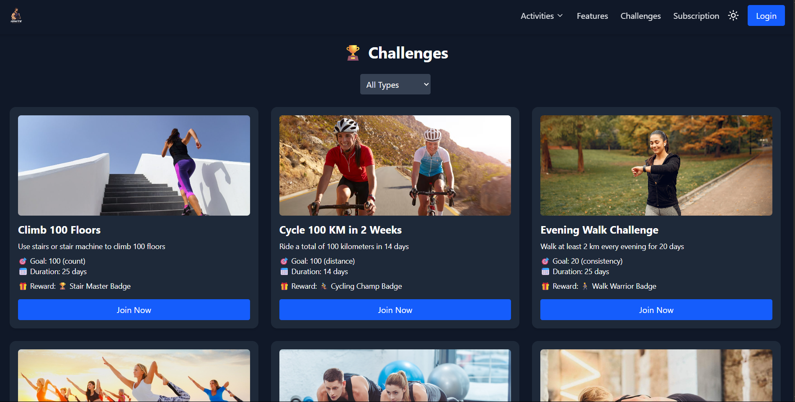
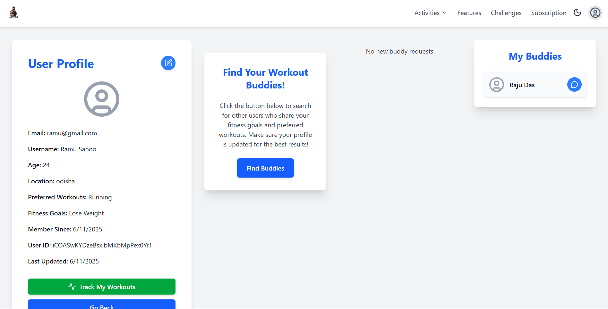
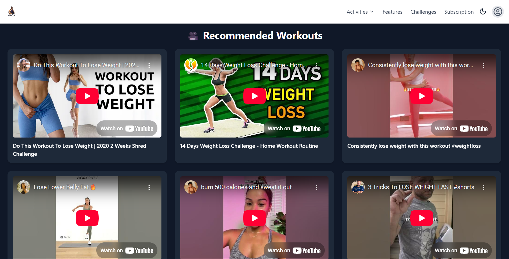

# 🏋️‍♂️ Ignite_App

**Ignite_App** is a modern, full-stack fitness application built with **React**, **Firebase**, **Redux Toolkit**, and **Tailwind CSS**. It helps users set fitness goals, track progress, join community challenges, explore workout resources, and connect with like-minded fitness enthusiasts.

---

## 🚀 Features

- ✅ **User Authentication** (Sign up / Sign in via Firebase Auth)
- 🧠 **Personalized Fitness Goals** and progress tracking
- 🎯 **Goal-Based Fitness Challenges** with rewards
- 🤝 **Buddy Matching System** to find fitness partners
- 📚 **Virtual Fitness Library** with curated YouTube workouts
- 🌐 **Responsive Design** — mobile-first UI using Tailwind CSS
- 🔥 **Real-time Data** with Firebase Realtime Database
- 🧭 **Role-based Navigation** and protected routes
- 🎉 **Toasts and Notifications** for actions and updates

---

## 📸 Screenshots

| Home                            | Challenges                                  | Profile Matching                      | Recomendation                                     |
| ------------------------------- | ------------------------------------------- | ------------------------------------- | ------------------------------------------------- |
|  |  |  |  |

---

## ⚙️ Tech Stack

- **Frontend**: React, React Router, Tailwind CSS
- **State Management**: Redux Toolkit
- **Backend**: Firebase Authentication & Realtime Database
- **Notifications**: `react-hot-toast`
- **Deployment**: Firebase Hosting / Vercel (Optional)

---

## 🛠️ Installation

```bash
# Clone the repo
git clone https://github.com/your-username/FitnessBuddy_App.git
cd FitnessBuddy_App

# Install dependencies
npm install

# Run the development server
npm run dev
```

## 📁 Project Structure

```
FitnessBuddy_App/
├── public/
├── screenshots/
├── src/
│   ├── components/
│   ├── features/
|   ├── hooks/
│   ├── pages/
|   ├── redux/
│   ├── services/
│   ├── App.jsx
│   ├── main.jsx
│   └── ...
├── .gitignore
├── eslint.config.js
├── index.html
├── package-lock.json
├── package.json
├── vite.config.js
└── README.md
```

## 🔐 Firebase Setup

### 1. Create a Firebase Project

- Go to the [Firebase Console](https://firebase.google.com/) and create a new project.

### 2. Enable Email/Password Authentication

- In the Firebase Console, navigate to **Authentication** → **Sign-in method**
- Enable **Email/Password** login.

### 3. Enable Realtime Database

- Go to **Realtime Database** → Click **Create Database**
- Choose your region and start in **test mode** (you can set stricter rules later).

### 4. Replace Firebase Config in `src/services/firebase.js`
